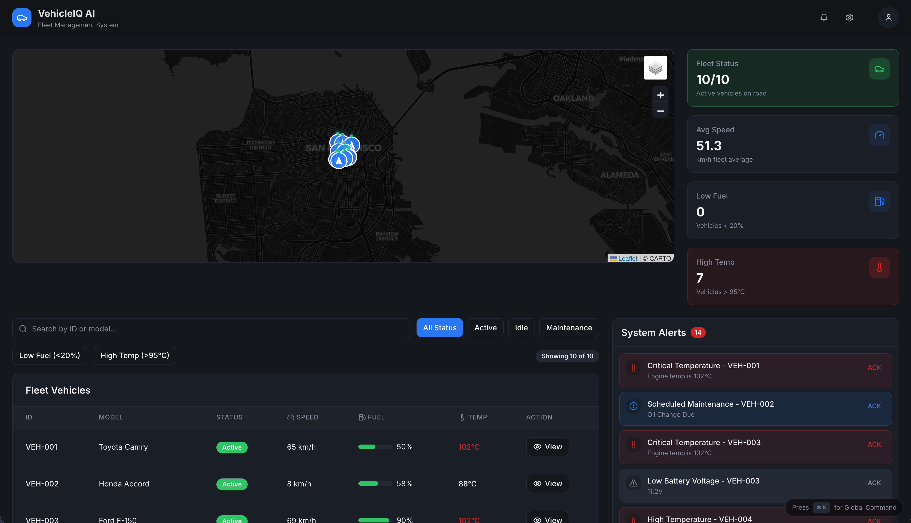
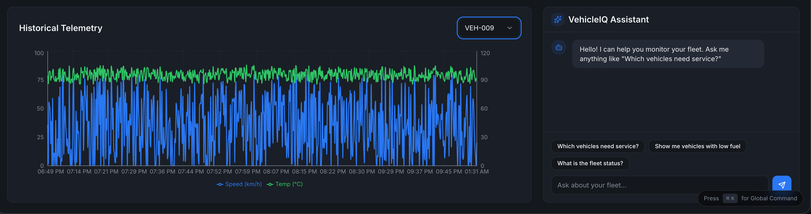
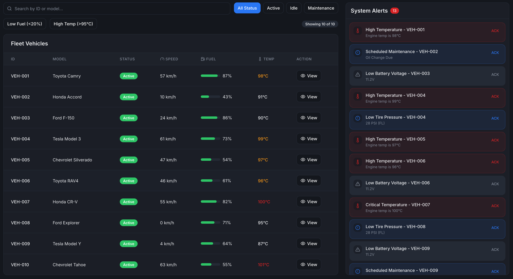
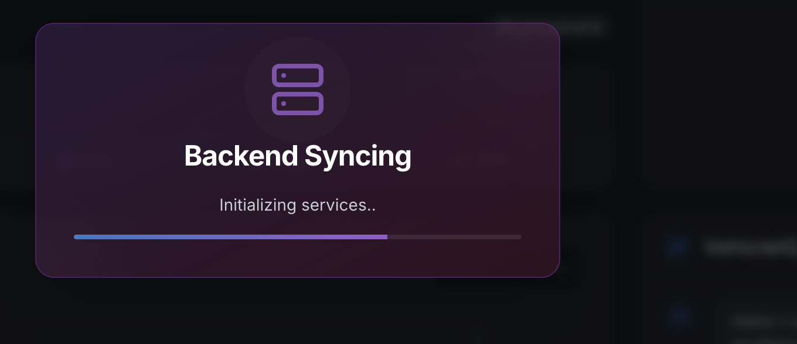

# 🚗 VehicleIQ AI - Smart Fleet Management Dashboard

<div align="center">

**Real-time Fleet Tracking • AI-Powered Insights • Predictive Maintenance**

[](https://vehicleai-ft.onrender.com)
[](https://opensource.org/licenses/MIT)
[](https://www.typescriptlang.org/)
[](https://reactjs.org/)
[](https://nodejs.org/)
[](https://www.python.org/)

</div>

---

## 📸 Screenshots

### Main Dashboard

*Real-time fleet monitoring with interactive map, live telemetry, and vehicle status*

### AI Assistant & Analytics

*Natural language chat interface powered by OpenAI for fleet insights*

### Vehicle Details & Telemetry

*Detailed vehicle information with historical telemetry charts*

### Alert Management

*Real-time alerts for critical issues like low fuel and high temperature*

### Backend Sync Loading

*Beautiful loading popup with glassmorphic design during backend initialization*

---

## ✨ Features

### 🗺️ Real-Time Fleet Tracking
- **Interactive Map**: Live vehicle locations using Leaflet with custom markers
- **WebSocket Updates**: Real-time position updates every 5 seconds
- **Vehicle Clustering**: Smart grouping for large fleets
- **Route History**: Track vehicle movements over time

### 📊 Live Telemetry Dashboard
- **Real-time Metrics**: Speed, fuel level, engine temperature, battery voltage
- **Historical Charts**: Interactive graphs using Recharts
- **Performance Analytics**: Fleet-wide statistics and averages
- **Customizable Views**: Filter and sort by multiple criteria

### 🤖 AI-Powered Intelligence
- **Predictive Maintenance**: Machine Learning (Random Forest) predicts service needs
- **Natural Language Chat**: Ask questions like "Which vehicles need service?" using OpenAI
- **Smart Recommendations**: AI-driven insights for fleet optimization
- **Anomaly Detection**: Automatic identification of unusual patterns

### 🚨 Alert System
- **Real-time Notifications**: Instant alerts for critical issues
- **Priority Levels**: Color-coded alerts (critical, warning, info)
- **Acknowledgment Tracking**: Mark alerts as reviewed
- **Alert Types**: Low fuel, high temperature, maintenance due, battery issues

### 📈 Advanced Analytics
- **Fleet Performance**: Track KPIs across your entire fleet
- **Fuel Efficiency**: Monitor consumption patterns
- **Maintenance History**: Complete service records
- **Custom Reports**: Generate insights for specific time periods

### 🎨 Modern UI/UX
- **Glassmorphic Design**: Beautiful frosted glass effects
- **Dark Theme**: Easy on the eyes with vibrant accents
- **Responsive Layout**: Works seamlessly on desktop, tablet, and mobile
- **Smooth Animations**: Micro-interactions for enhanced user experience
- **Command Center**: Quick access keyboard shortcuts (Cmd/Ctrl + K)

---

## 🏗️ Architecture

VehicleIQ is built as a modern microservices architecture:

```
┌─────────────────┐      ┌─────────────────┐      ┌─────────────────┐
│                 │      │                 │      │                 │
│    Frontend     │◄────►│    Backend      │◄────►│   AI Service    │
│   (React/TS)    │      │   (Node.js)     │      │    (Python)     │
│                 │      │                 │      │                 │
└─────────────────┘      └─────────────────┘      └─────────────────┘
        │                        │                         │
        │                        │                         │
        ▼                        ▼                         ▼
   Static Site              PostgreSQL              scikit-learn
   (Vite Build)             + Redis                 + OpenAI API
```

### Components

#### **Frontend** (`/frontend`)
- **Framework**: React 18 with TypeScript
- **State Management**: Redux Toolkit
- **UI Components**: Custom components with shadcn/ui
- **Charts**: Recharts for data visualization
- **Maps**: Leaflet for interactive mapping
- **Styling**: Tailwind CSS with custom glassmorphic theme
- **Build Tool**: Vite

#### **Backend** (`/backend`)
- **Runtime**: Node.js with Express
- **Language**: TypeScript
- **Real-time**: Socket.io for WebSocket connections
- **Database**: PostgreSQL (production) / SQLite (local dev)
- **Caching**: Redis (production) / In-memory (local dev)
- **Features**: RESTful API, vehicle simulator, alert management

#### **AI Service** (`/ai-service`)
- **Framework**: Flask (Python)
- **ML Model**: Random Forest for predictive maintenance
- **NLP**: OpenAI GPT for natural language queries
- **Libraries**: scikit-learn, pandas, numpy
- **Features**: Maintenance prediction, chat interface

---

## 🚀 Tech Stack

### Frontend


### Backend


### AI/ML


### DevOps


---

## 📋 Prerequisites

- **Node.js** v18+ 
- **Python** 3.10+
- **npm** or **yarn**
- **OpenAI API Key** (for AI chat features)
- **Docker** (optional, for containerized deployment)

---

## 🛠️ Installation & Setup

### Option 1: Quick Start (Local Development)

This project is configured to run locally using SQLite and in-memory Redis, so you **don't need Docker** or complex system installations.

1. **Clone the repository**
   ```bash
   git clone https://github.com/rachana33/vehicleiq-ai.git
   cd vehicleiq-ai
   ```

2. **Install dependencies**
   ```bash
   npm run setup
   ```
   This will install dependencies for all three services (frontend, backend, AI).

3. **Configure environment variables**
   ```bash
   cp .env.example .env
   ```
   Edit `.env` and add your OpenAI API key:
   ```env
   OPENAI_API_KEY=sk-your-actual-openai-key-here
   ```

4. **Start all services**
   
   Open **3 separate terminal windows** and run:

   **Terminal 1 - Backend (Port 3001)**
   ```bash
   npm run start:backend
   ```

   **Terminal 2 - AI Service (Port 5000)**
   ```bash
   npm run start:ai
   ```

   **Terminal 3 - Frontend (Port 5173)**
   ```bash
   npm run start:frontend
   ```

5. **Access the application**
   
   Open your browser and navigate to:
   ```
   http://localhost:5173
   ```

### Option 2: Docker Compose

For a containerized setup:

```bash
# Build and start all services
docker-compose up --build

# Access the application
open http://localhost:5173
```

---

## 🌐 Deployment

### Deploy to Render

This project includes a `render.yaml` Blueprint for easy deployment to Render.

1. **Fork this repository** to your GitHub account

2. **Create a new Blueprint** on Render:
   - Go to [Render Dashboard](https://dashboard.render.com/)
   - Click "New" → "Blueprint"
   - Connect your GitHub repository
   - Render will automatically detect `render.yaml`

3. **Add environment variables**:
   - Navigate to the `vehicleiq-ai-service` in Render Dashboard
   - Go to "Environment" tab
   - Add: `OPENAI_API_KEY` = `your-openai-api-key`

4. **Deploy**:
   - Render will automatically deploy all three services
   - Frontend, Backend, and AI Service will be live in minutes
   - Auto-deploy is enabled for the `main` branch

**Note**: Render's free tier may have cold start delays (30-60 seconds). The app includes a beautiful loading popup to handle this gracefully.

---

## 📖 API Documentation

### Vehicles

| Method | Endpoint | Description |
|--------|----------|-------------|
| `GET` | `/api/vehicles` | Get all vehicles |
| `GET` | `/api/vehicles/:id` | Get vehicle by ID |
| `GET` | `/api/vehicles/:id/history` | Get telemetry history for a vehicle |

### Alerts

| Method | Endpoint | Description |
|--------|----------|-------------|
| `GET` | `/api/alerts` | Get all active alerts |
| `POST` | `/api/alerts/:id/acknowledge` | Acknowledge an alert |

### AI Service

| Method | Endpoint | Description |
|--------|----------|-------------|
| `POST` | `/api/ai/chat` | Chat with AI assistant |
| `GET` | `/api/ai/predict-maintenance/:id` | Get maintenance prediction for vehicle |

### Health Check

| Method | Endpoint | Description |
|--------|----------|-------------|
| `GET` | `/health` | Backend health status |

---

## 🎯 Use Cases

### 1. **Fleet Managers**
- Monitor entire fleet in real-time
- Receive instant alerts for critical issues
- Optimize routes and fuel consumption
- Schedule preventive maintenance

### 2. **Operations Teams**
- Track vehicle locations and status
- Analyze performance metrics
- Respond quickly to emergencies
- Generate operational reports

### 3. **Maintenance Teams**
- Predict when vehicles need service
- Track maintenance history
- Reduce unexpected breakdowns
- Optimize maintenance schedules

### 4. **Business Analysts**
- Analyze fleet performance trends
- Identify cost-saving opportunities
- Generate custom reports
- Make data-driven decisions

---

## 🧪 Testing

```bash
# Run frontend tests
cd frontend
npm test

# Run backend tests
cd backend
npm test

# Run AI service tests
cd ai-service
python -m pytest
```

---

## 🤝 Contributing

Contributions are welcome! Please follow these steps:

1. Fork the repository
2. Create a feature branch (`git checkout -b feature/AmazingFeature`)
3. Commit your changes (`git commit -m 'Add some AmazingFeature'`)
4. Push to the branch (`git push origin feature/AmazingFeature`)
5. Open a Pull Request

---

## 📝 License

This project is licensed under the MIT License - see the [LICENSE](LICENSE) file for details.

---

## 🙏 Acknowledgments

- **OpenAI** for GPT API
- **Leaflet** for mapping capabilities
- **shadcn/ui** for beautiful UI components
- **Render** for hosting platform

---

## 📧 Contact

**Rachana** - [@rachana33](https://github.com/rachana33)

**Project Link**: [https://github.com/rachana33/vehicleiq-ai](https://github.com/rachana33/vehicleiq-ai)

---

<div align="center">

**⭐ Star this repo if you find it useful!**

Made with ❤️ by [Rachana](https://github.com/rachana33)

</div>
